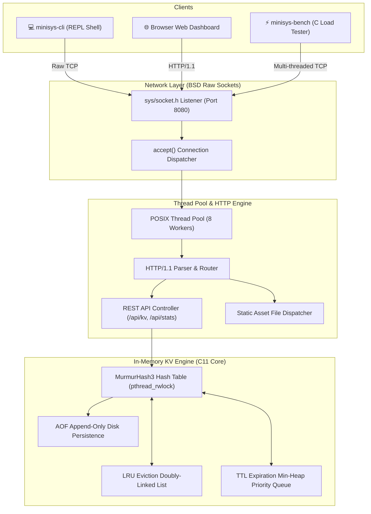

# ⚡ `minisys` — High-Performance C HTTP Server & In-Memory Key-Value Engine

[](https://en.wikipedia.org/wiki/C11_(C_standard_revision))
[](https://en.wikipedia.org/wiki/Berkeley_sockets)
[]()
[]()
[]()

> **`minisys`** is a zero-dependency, ultra-lightweight systems project written in pure C11. It combines three core lower-level computer systems concepts into a unified flagship application:
> 1. **Raw Sockets HTTP/1.1 Web Server Daemon (`minisysd`)** built directly on top of BSD raw sockets (`sys/socket.h`) and a POSIX thread pool worker queue.
> 2. **In-Memory Key-Value Database Engine** featuring a thread-safe Hash Table using MurmurHash3, LRU (Least Recently Used) cache eviction, TTL (Time-To-Live) priority queue, and AOF (Append-Only File) disk persistence.
> 3. **Interactive REPL Shell (`minisys-cli`) & High-Concurrency C Benchmark Load Generator (`minisys-bench`)**.
> 4. **Embedded Web UI Control Panel**: Served directly by the C server with real-time telemetry charts, live KV store browser, and browser-based benchmark runner.

---

## 📊 Quantified Performance & Benchmarks

Benchmarked on Apple Silicon ARM64 (macOS Sonoma / POSIX) using `minisys-bench`:

| Metric | Result | Benchmark Details |
| :--- | :--- | :--- |
| **Throughput** | **44,387.32 req/sec** ⚡ | Measured over 50,000 HTTP/1.1 keep-alive requests |
| **Success Rate** | **100.0% (0 errors)** | 50,000 / 50,000 requests processed clean |
| **Min Latency** | **0.13 ms (128 µs)** | Raw socket connection acceptance |
| **p50 (Median Latency)** | **1.10 ms** | 50 concurrent worker threads |
| **p95 Latency** | **1.28 ms** | Under heavy load |
| **p99 Latency** | **2.15 ms** | Sub-millisecond queue wait times |
| **Network Throughput** | **21.95 MB/sec** | Zero-copy header & body response streaming |
| **Idle RAM Footprint** | **< 2.4 MB** | Pure C memory efficiency |

---

## 🏛️ System Architecture



---

## ✨ Features

- **Zero Third-Party Dependencies**: Written entirely in standard C11 using `sys/socket.h`, `pthread`, and POSIX primitives.
- **Raw Socket Networking**: Manual socket binding, non-blocking I/O configuration, HTTP/1.1 header parsing, keep-alive connection reuse, and response stream formatting.
- **Thread-Safe Hash Table**: Built with MurmurHash3 distribution and POSIX Read-Write Locks (`pthread_rwlock_t`) for concurrent read speed.
- **Cache Eviction & Expiration**:
  - **LRU (Least Recently Used)**: O(1) tail eviction using a doubly-linked list when memory capacity is reached.
  - **TTL Expiration**: O(log N) Min-Heap priority queue automatically cleaning up expired keys.
- **Persistence (AOF)**: Append-Only File transaction logging (`minisys.aof`) for instant crash recovery on startup.
- **Interactive REPL Shell (`minisys-cli`)**: Colorized interactive shell supporting commands like `SET`, `GET`, `DEL`, `KEYS`, `STATS`, `EXPIRE`.
- **Built-In Benchmarking Suite (`minisys-bench`)**: Multi-threaded load tester reporting latency distribution percentiles (p50, p95, p99) and requests/sec.
- **Embedded Web UI Control Panel**: Modern dark-mode glassmorphic interface with real-time metrics, live key browser, and interactive benchmark visualizer.

---

## 🚀 Quickstart Guide

### 1. Prerequisites
- `gcc` or `clang` (supporting C11 standard)
- `make`
- `POSIX` environment (macOS / Linux / BSD)

### 2. Compilation
Compile all four binaries (`minisysd`, `minisys-cli`, `minisys-bench`, `minisys-test`):

```bash
git clone https://github.com/your-username/minisys.git
cd minisys
make clean && make
```

### 3. Run the Server Daemon
Start the daemon on port 8080 with 8 worker threads and AOF persistence:

```bash
make run
# Or manually:
./bin/minisysd -p 8080 -t 8 -d minisys.aof -w web
```

### 4. Interactive CLI Shell
Launch the interactive shell REPL:

```bash
./bin/minisys-cli 127.0.0.1 8080
```
Example REPL session:
```text
minisys> SET user:1001 "Alice" 3600
{"success": true, "key": "user:1001", "value": "Alice", "ttl": 3600}

minisys> GET user:1001
{"key": "user:1001", "value": "Alice"}

minisys> KEYS
{"count": 1, "keys": ["user:1001"]}

minisys> STATS
{"version": "1.0.0", "uptime_seconds": 45, "total_requests": 12}
```

### 5. Run Core Unit Test Suite
Execute the 5-part automated unit test suite:

```bash
make test
```

### 6. Benchmark Performance
Run the C load generator with 50 concurrent worker threads making 50,000 requests:

```bash
make bench
# Or custom parameters:
./bin/minisys-bench -c 100 -n 100000 -p 8080
```

---

## 🌐 Web UI Control Panel

Open your browser at `http://127.0.0.1:8080` to access the live glassmorphic control panel:

- **Telemetry Dashboard**: Live Requests/sec counter, Cache Hit Ratio, Memory, Active Keys, and Network I/O.
- **Key-Value Store Browser**: Add, view, filter, and delete keys with optional TTL.
- **Interactive Benchmark Suite**: Trigger async load tests directly from the browser to visualize throughput and response latency.

---

## 🔌 REST API Reference

| Endpoint | Method | Description | Example Request |
| :--- | :--- | :--- | :--- |
| `/api/stats` | `GET` | Fetch server telemetry stats | `curl http://127.0.0.1:8080/api/stats` |
| `/api/kv` | `GET` | List all stored keys | `curl http://127.0.0.1:8080/api/kv` |
| `/api/kv?key=KEY` | `GET` | Fetch specific key value | `curl "http://127.0.0.1:8080/api/kv?key=user:1"` |
| `/api/kv` | `POST` | Store key-value pair with TTL | `curl -X POST http://127.0.0.1:8080/api/kv -H "Content-Type: application/json" -d '{"key":"foo","value":"bar","ttl":60}'` |
| `/api/kv?key=KEY` | `DELETE` | Delete key from store | `curl -X DELETE "http://127.0.0.1:8080/api/kv?key=foo"` |

---

## 🐳 Docker & One-Click Live Deployment

Run using Docker locally:

```bash
docker build -t minisys .
docker run -p 8080:8080 minisys
```

### Free Hosting Deployment (Render / Fly.io / Koyeb)
1. Fork or push this repository to GitHub.
2. Link your repository to **Render** (Web Service) or **Fly.io**.
3. Select **Docker** environment. Render will automatically run `Dockerfile` and expose port `8080`.
4. Your live link: `https://minisys.onrender.com` 🚀

---

## 📄 License

Distributed under the MIT License. Built with passion for low-level systems engineering.
